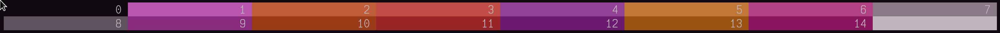
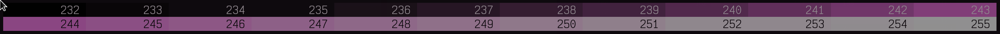
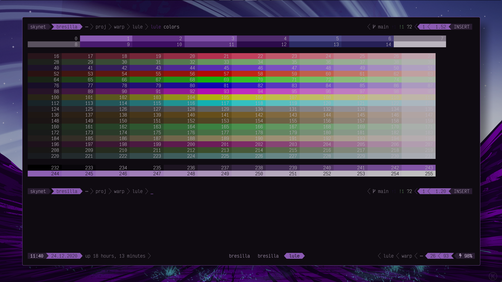
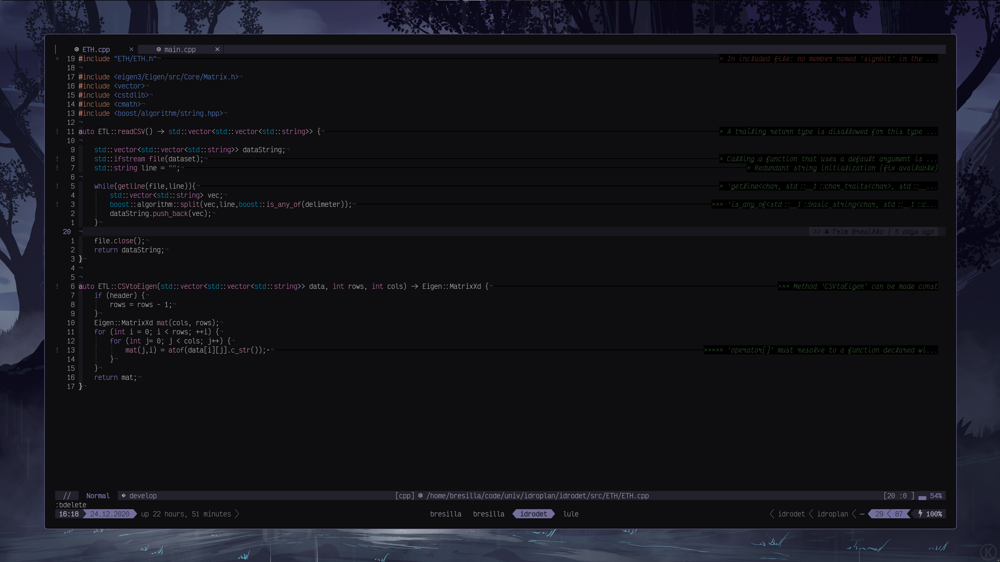
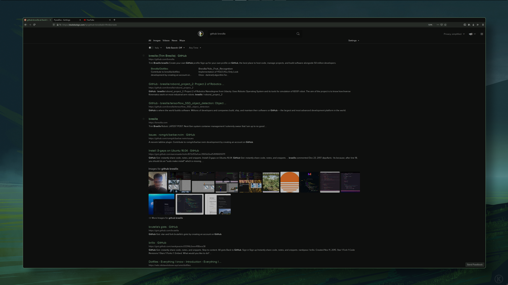
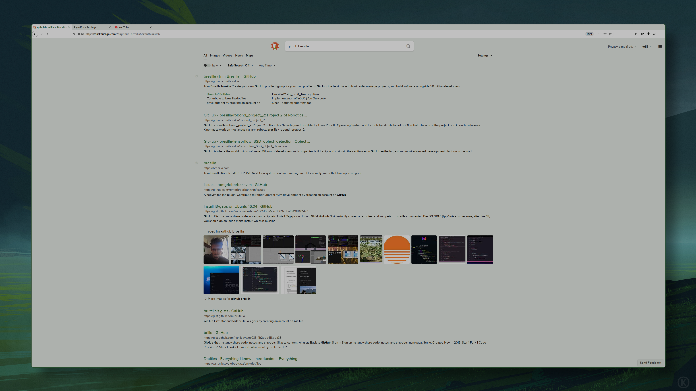

lule
===

A bash(y) alternative to [pywal](https://github.com/dylanaraps/pywal) by mostly using [pastel](https://github.com/sharkdp/pastel) to generate the full 255 colors from an image. 

```
lule --image=/some/path/of/an/image.jpg --palette=convert set
```
<hr>


<hr>

# FAQ

Well, not actually frequently asked questions (cos this tool is still new, still no questions), but just some predicted FAQ:

## Why is lule not applying my colors?
Well, lule is divided in two separate scripts: `lule` and `lule_colors`. `lule` is responsible to generate colors and all
other options related to color generation and is 99.9% of the code. In the other side `lule_colors` is extremely simple,
it just sends those colors to apps like: all open `tty`'s, or firefox through [pywalfox](https://github.com/Frewacom/Pywalfox), or neovim...


## Why another X?

The advantages to __pywal__ are that __lule__ generates all 255 colors, not just 8 (or 16). Many times, when you want to
apply colors (especially in neovim) you need more shades of the accent color, and that is why i made this tool initially.


## Why bash?
Well, initially i made a simple script to add more colors to __pywal__. Then many times pywal was having problems with other python 
packages, thus i completely substituted it with __pastel__. Then the script grew larger and i thougth of sharing instead of using just by myself.


In the future (when and if i have enough time), i will make it a binary (__rust__ or __go__) and then you are saved from dependency hell.

## Where are those wallpapers from?

They are from the very talented [Michal](https://twitter.com/kvacm) from the Czech Republic, a freelance digital artist and illustrator.
You can get (buy) all his wallpapers from his [artstation]( https://kvacm.artstation.com/store) or support him in [patreon](https://www.patreon.com/kvacm)
to get at least five high-quality wallpapers per month (worth every penny, trust me).

# HELP `lule --help`

```
lule v.0.1
a command line to set 255 colors on tty's and other places that use ANSI colors

USAGE:
    lule [options][flags] <command>
    lule <special> [flags]

OPTIONS:
    --palette[=]<name> -> { pigmnts } , schemer2 , convert , imgscheme , 
        specify the palette binary to use
    --configs[=]<filepath> :: or specify $LULE_C as environment variable
        specify a config file where to load color preferences
    --scheme[=]<name> -> default , 
        specify the scheme form configs
    --sort[=]<name> -> brightness , luminance , hue , { chroma } , random , 
        specify the sorting colors of palette
    --saturate[=]<value> -> only numbers (0.0-1.0) are valid
        ammout of saturation of main colors
    --image[=]<filepath>
        specify the image to extract colors from
    --script[=]<filepath> :: or specify $LULE_S as environment variable
        specify an external script to run after colors are generated
    --wallpath[=]<dirpath> :: or specify $LULE_W as environment variable
        specify a folder to pick an image randomly
    --loop[=]<seconds> -> only numbers are valid
        loop through directory (needs $LULE_W or $--wallpath)

FLAGS:
    -n  dont set wallpaper
    -d  dont set colors
    -p  read values from pipe/stdin
    -f  refresh the colors  * 
    -r  reset default colors  * 
  flags marked with:  *  should be used alone eg.:  lule -r 

COMMANDS:
    set          generate new colors from new image
    regen        generate new colors from same image
    theme        invert dark and light theme
    pick         pick a color as accent color

SPECIAL:
    colors [flags]       print all 255 colors in terminal  * 
    palette [flags]      more info about different palette generators  * 
    configs [flags]      set and save color configure options * 
  commands marked with  *  have their own flags, check: lule <special> -h 
```


# DEPENDENCIES
This tool assumes (depends) that you have all these tools into your path:

| tool and link       | usage     |
| :------------- | :----------: |
| [pastel](https://github.com/sharkdp/pastel) | Color manipulation   |
| [jq](https://github.com/stedolan/jq)   | Load and save configs |
| [feh](https://feh.finalrewind.org/)   | Applying wallpaper |
| [xcolor](https://github.com/Soft/xcolor)   | Picking a color from X11 screen |

In addition, this tool relies on common GNU tools like: awk, grep, sed ...

And wants at least one of these tools:
| tool and link       | usage     |
| :------------- | :----------: |
| [pigmnts](https://github.com/blenderskool/pigmnts) | color palette from image |
| [schemer2](https://github.com/thefryscorer/schemer2) | color palette from image |
| [convert](https://github.com/ImageMagick/ImageMagick) | color palette from image |
| [imgscheme](https://github.com/wwalexander/imgscheme) | color palette from image |


# COLORS
A 256-color lookup table is common in almost all modern terminals thus escape sequences were added to select from a 
pre-defined set of 256 colors. __lule__ genarates all those colors from an image. There are few steps in 
color generation:

### 1 Generate palette


In this step, an image is provided as input then most of the dominant colors are generated. One of the dependency tools 
showed above will be used to generate 16 dominant colors.

### 2 DARK and LIGHT
Two immportant colors: `$DARK="#000000"` and `$LIGHT="FFFFFF"` color variables are created. Those colors serve
to blend all other colors after

### 3 Main colors (0-15)


#### Select 6 colors
After colors are generated, top 6 colors are selected based on a filter (hue, illumiance ...) explained later in options.
Those would be: `$col1, $col2, $col3, $col4, $col5, $col6`

#### Assign accent
First color `$col1` from those 6 is selected, and saturated as the accent color `$ac` (which is the most important color of all)

#### Background and foreground
Background and foreground colors are then generated by mixing `$ac` with `$DARK` for `$col0` to give a shade of 
accent to backgroundcolor. The same with foreground, mixing `$ac` with `LIGHT` to generate `col15`

#### Generating grays
Then colors `col7` and `col8` are generated by mixing `$ac` with `#AAAAAA` and `$ac` with `#666666` respectively.

#### Lower intensity ones
From colors `$col1 ($ac), $col2, $col3, $col4, $col5, $col6` generate a less saturated version of each an use as colors
`$col9, $col10, $col11, $col12, $col13, $col14`


### 4 Crayscale colors (232-255)

Grayscale colors are not precisely grayscale, but in original ANSI 255 colors, they are grayscale, hence the name. Those colors
are shades of accent colors.

Those colors blend from `$DARK` to `$col0` to `$col1` to `$col15` and lastly to `$LIGHT`, so at then end we have a nice color 
progession from black to black accented to accent istelf to white accented and finally to white:

- `$col232` is the same as `$DARK`
- `$col233` is  blend between `$DARK` and `$col0` (background color)
- `$col234` is the same as `$col0` (background color)
- `$col235` to `$col242` are a blend betwen `$col0` (background color) and `$ac`
- `col243` is similar or a slighty __darker__ color of `$ac`
- `col244` is similar or a slighty __lighter__ color of `$ac`
- `$col245` to `$col252` are a blend betwen `$col15` (foreground color) and `$ac`
- `$col253` is the same as `$col15` (foreground color)
- `$col254` is  blend betwen `$LIGHT` and `$col15` (foreground color)
- `$col255` is the same as `$LIGHT`

### 5 Other colors (16-231)


Other colors represent colors that are not exactly extracted from the image. There are in total 18 other colors defined, each with
its own shades going from `$DARK` to color to `$LIGHT`, thus each color is represented with 12 different shades.

- Each group is represented with its own `$COLOR` hex value
- Then generate 14 colors from `$DARK` to `$COLOR` to `$LIGHT`
- Remove first (`$DARK`) and last (`$LIGHT`) to leave exacly 12 colors

### 1. RGB Blend
It represents three groups: RED, GREEN, BLUE but all mixed with `$ac`.

- In colors 16 to 27 the variable `$COLOR` is a blend between RED `#FF0000` and `$ac`
- In colors 28 to 39 the variable `$COLOR` is a blend between GREEN `#00FF00` and `$ac`
- In colors 40 to 51 the variable `$COLOR` is a blend between BLUE `#0000FF` and `$ac`

### 2. RGBMYC Original
It represents original RED GREEN BLUE MAGENTA YELLOW and CYAN colors
- In colors 52 to 63 the variable `$COLOR` is RED `#FF0000`
- In colors 64 to 75 the variable `$COLOR` is GREEN `#00FF00`
- In colors 76 to 87 the variable `$COLOR` is BLUE `#0000FF`
- In colors 88 to 99 the variable `$COLOR` is MAGENTA `#FF00FF`
- In colors 100 to 111 the variable `$COLOR` is YELLOW `#FFFF00`
- In colors 112 to 123 the variable `$COLOR` is CYAN `#00FFFF`

### 4. Gray Original
It represents original shades of gray
- In colors 124 to 135 the variable `$COLOR` is GRAY `#888888`

### 3. Random
There are left 8 groups. And for those gorups, `$COLOR` is randomly generated, then all shades are generated


# ENVIRONMENT
This tool depends on few environment variables too:
```
$LULE_W  --  wallpaper directory
$LULE_S  --  script filepath
$LULE_C  --  configs filepath
```

For example, if you dont want to specify always your folder directory where your wallpapers are, you can simply 
specify `$LULE_W` variable (and it shoud be a directory) then __lule__ picks an image there (randomly) to set as wallpaper.
Alternatively you can still use `lule --walldir=<dirpath>` which has precedence to `$LULE_W`

Then, `LULE_C`, is where a config file for __lule__ is. If you don't set this variable, then this is automatically
set to `$XDG_CONFIG/lule/config.json` or `$HOME/.config/lule/config.json`
Alternatively you can still use `lule --script=<filepath>` which has precedence to `$LULE_C`

Finally, there is `$LULE_S`, which should be a file/script, that lule will run automatically after colors are generated.
Usually here can be scripts for updating colors for neovim, Firefox with [pywalfox](https://github.com/Frewacom/Pywalfox)
and other scripts that you might find useful. Please check **lule_colors** from this repo to get started.
The script is forked, thus it does not affect the __lule__ app itself.
Alternatively you can still use `lule --script=<filepath>` which has precedence to `$LULE_S`

### <span style="color:'ff0000'">**IMPORTANT:** Colors are not applied by **lule** itself, you need an external script to do that. For that you can check **lule_colors** that sends all the sequence of colors to all open `tty`'s  and updating the colors instantly. </span>

# USAGE

## COMMANDS
There are four main commands in __lule__
```
set    -- generate new colors from new image
regen  -- generate new colors from same image
theme  -- invert dark and light theme
pick   -- pick a color as accent color
```

### `lule set`

This is the main command to set a new colorscheme. 

It needs either `$LULE_W` to be set before using it:
```
LULE_W=$HOME/.local/share/wallpapers
lule set
```

Or using `--walldir=<path>` to specify before using it:
```
lule --walldir="LULE_W=$HOME/.local/share/wallpapers" set
```
Here are some examples from four different images:


### `lule regen`

It's one of the commands that regenerates colors from the same image. Very useful when you want to change the `--palette` or `--sort` which are explained later in [OPTIONS](#options)

### `lule theme`

It simply switches from __dark__ to __light__ of current colorscheme, or vice-versa. Every time `lule theme`
is run, it alternates between those two.

##### How it works:
As explained in [black and white](#2-dark-and-light), variables `$DARK"` and `$LIGHT` are created at the beginning.
This command simply inverts them, thus if `$DARK` is `"#000000"` and `$LIGHT` is `"FFFFFF"` then `$DARK` becomes `#FFFFFF`
and `$LIGHT` becomes `#000000`, and vice versa.

Here an example of by simply running `lule theme`:
- Dark theme (colrs)

- Light theme (colors)

- Dark theme (neovim)

- Light theme (neovim)

- Dark theme (firefox using [pywalfox](https://github.com/Frewacom/Pywalfox))

- Light theme (firefox using [pywalfox](https://github.com/Frewacom/Pywalfox))



### `lule pick`

It's a command that depends on [xcolor](https://github.com/Soft/xcolor) to pick as `$ac` one color from the picker.
From that picked color all other colors are regenerated.

## OPTIONS (TODO)

### `lule --palete[=]<name>`
### `lule --configs[=]<filepath>`
### `lule --scheme[=]<name>`
### `lule --sort[=]<name>`
### `lule --saturate[=]<value>`
### `lule --image[=]<filepath>`
### `lule --script[=]<filepath>`
### `lule --wallpath[=]<dirpath>`
### `lule --loop[=]<seconds>`

## SPECAL COMMANDS (TODO)
There are some other special commands in __lule__ too
```
colors    --       print all 255 colors in terminal
palette   --      more info about different palette generators
configs   --      set and save color configure options
```

each of these has its own subcommands and flags, use `lule <special> -h` from more info
